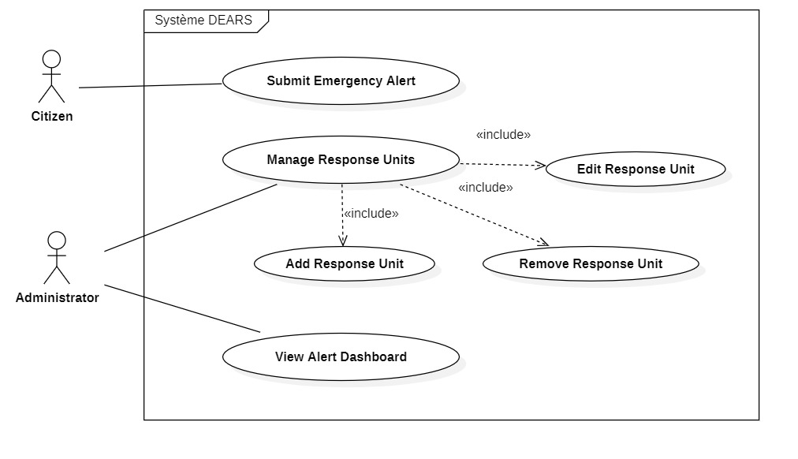

## Distributed Emergency Alert & Response System (DEARS)

**Initial Design, Objectives, and Architecture (MVP)**

- **Author:** Anass Allabouch
- **Date:** 07/11/2025

---

## 1. Introduction and Project Objective

### 1.1 Project Objective

The goal of this project is to implement a **Distributed Emergency Alert & Response System (DEARS)**. This system will allow citizens to rapidly report emergency situations (such as Police, Fire, or Medical) via a user-friendly web interface.

The core of the system lies in its distributed architecture, which will **intelligently route** these alerts to the appropriate response services (Police, Firefighters, Medical Services) using remote communication technologies.

### 1.2 Distributed Context

In accordance with project requirements, a distributed architecture is not only required but essential for the nature of this application. The desired advantages are:

- **Resilience:** The separation of services (e.g., Police Service, Fire Service) ensures that the failure of one component does not lead to a complete system shutdown.
- **Scalability:** Each service (Web Interface, Dispatcher, Response Services) can be scaled independently to handle different loads.
- **Specialization:** Allows each emergency service to manage its own business logic and resources autonomously after receiving an alert.

---

## 2. Key Features (MVP) and Roles

### 2.1 System Actors

| Actor                          | Primary Role                                                                                             |
| :----------------------------- | :------------------------------------------------------------------------------------------------------- |
| **Citizen**                    | Any user accessing the web interface to submit an emergency alert.                                       |
| **Dispatcher (System)**        | The automated central component that receives and routes alerts.                                         |
| **Response Services (System)** | The backend components (Police, Fire, Medical) that receive the routed alerts.                           |
| **Administrator**              | User with high privileges for system supervision and response unit management (Not prioritized for MVP). |

### 2.2 Minimum Viable Product (MVP) Features

| Role                            | Features                                                                                                                                                                                                                                                                                    |
| :------------------------------ | :------------------------------------------------------------------------------------------------------------------------------------------------------------------------------------------------------------------------------------------------------------------------------------------ |
| **Alert Management (Citizen)**  | _ Submit a new emergency alert via a web form. _ Select the type of emergency (Police, Fire, Medical). _ Provide a brief description. _ Provide location coordinates (e.g., simulation by input or map click). \* Receive confirmation of alert submission.                                 |
| **Alert Routing (Dispatcher)**  | _ Receive the alert from the web interface (via REST/HTTP). _ Validate and analyze the alert (type, location). \* Transmit the alert to the appropriate distributed service via a **Remote Procedure Call (RPC)**.                                                                          |
| **Alert Processing (Services)** | _ Receive the remote call (RPC) from the Dispatcher. _ Log the alert in the shared database. _ Execute business logic: identify the closest and available response unit (based on coordinates). _ Update the unit status (e.g., "en route"). \* Return an acknowledgment to the Dispatcher. |

---

## 3. Technology Choices and Architecture

### 3.1 Distributed Communication Technology

**Choice: RPC (Remote Procedure Call)**

**Justification:** The project mandates the use of RPC, RMI, or CORBA. Since the team has chosen Python as the main language, RPC is the natural technology choice, as specified in the project document (Python (for RPC)). This allows for maintaining a consistent technology stack (Full-Stack Python).

### 3.2 Technology Stack

| Component                           | Technology  | Library / Framework                                       |
| :---------------------------------- | :---------- | :-------------------------------------------------------- |
| **Distributed Backend Services**    | Python      | `xmlrpc.server` (Python standard library for RPC) or gRPC |
| **Backend (Dispatcher)**            | Python      | `xmlrpc.client` (Python standard library for RPC)         |
| **Web Interface (Frontend)**        | Python      | Django                                                    |
| **Web -> Dispatcher Communication** | REST (HTTP) | REST API provided by Django                               |
| **Database**                        | PostgreSQL  | Neon (https://neon.com/) - Serverless Postgres            |
| **Version Control**                 | Git         | GitHub                                                    |

### 3.3 Detailed Architecture and Data Flow

The alert processing flow is as follows:

1.  **Submission (Web UI):** The Citizen fills out the form on the **Django Web App**. The application sends a **REST (HTTP) request** to the **Dispatcher Server**.
2.  **Routing (Dispatcher):** The Dispatcher Server (a Python server) receives the HTTP request. It analyzes the emergency type and coordinates.
3.  **Distributed Call (RPC):** The Dispatcher acts as an RPC Client. It performs a Remote Procedure Call (e.g., `send_police_alert(coords, description)`) to the RPC Server of the relevant service (Police Service, Fire Dept Service, or Medical Service).
4.  **Processing (Distributed Services):** The Services (Police, Fire, Medical) are independent Python RPC Servers.
    - They receive the RPC call.
    - They connect to the **Shared Database (MySQL)** to query available units.
    - They select the closest unit and update its status in the database.
    - They return a success confirmation to the Dispatcher Server via the RPC response.
5.  **Confirmation (Web UI):** The Dispatcher Server receives the RPC confirmation and sends an HTTP response (e.g., "Alert received and transmitted") back to the Django Web App, which informs the citizen.

## 4. Team Role Distribution (8 Members)

| Role                                   | Count | Primary Responsibilities                                                                                                                                                     |
| :------------------------------------- | :---- | :--------------------------------------------------------------------------------------------------------------------------------------------------------------------------- |
| **Project Manager & System Architect** | 1     | Designs the distributed architecture, plans tasks, coordinates the team, manages GitHub, validates deliverables, and supervises tests.                                       |
| **Backend Developers**                 | 4     | Implement remote servers (RPC), define remote interfaces and methods, ensure client-server communication, and database integration. (Includes Dispatcher and the 3 Services) |
| **Frontend Web Developers**            | 2     | Develop the user interface (HTML, CSS, JavaScript, Django), ensure interaction with the backend (REST), and optimize user experience.                                        |
| **Database Engineer**                  | 1     | Designs and manages the database schema (MySQL), configures the connection, and optimizes SQL queries.                                                                       |

## 5. UML Diagrams

### 5.1 Use Case Diagram

The Use Case diagram above illustrates the core interactions in the DEARS system:

**Actors:**

- **Citizen**: Can submit emergency alerts
- **Administrator**: Manages response units and monitors alerts

**Main Use Cases:**

- **Submit Emergency Alert**: Allows citizens to report emergencies
- **Manage Response Units**: Enables administrators to handle unit operations
- **Edit/Add/Remove Response Unit**: Sub-functions of unit management
- **View Alert Dashboard**: Provides administrators with system overview

**Relationships:**

- The «include» relationships show that unit management includes the ability to edit, add, and remove response units

### 5.2 Class Diagram

[Coming soon]

### 5.3 Sequence Diagram

[Coming soon]

### 5.4 Deployment Diagram

[Coming soon]
