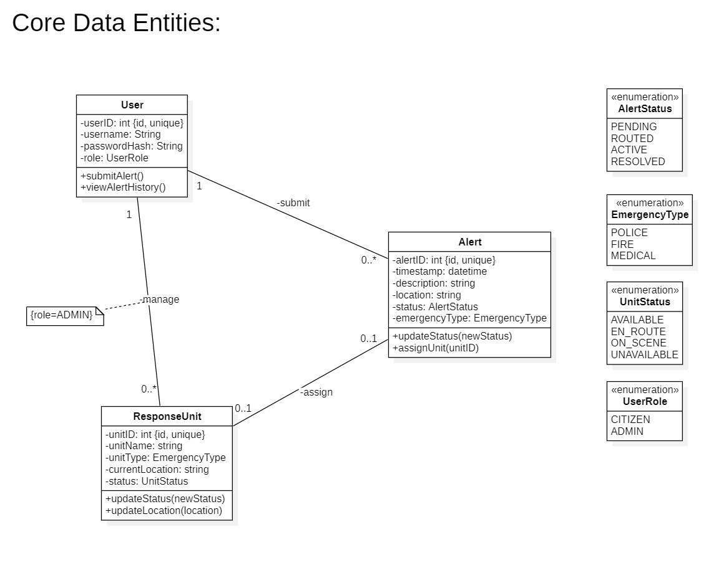
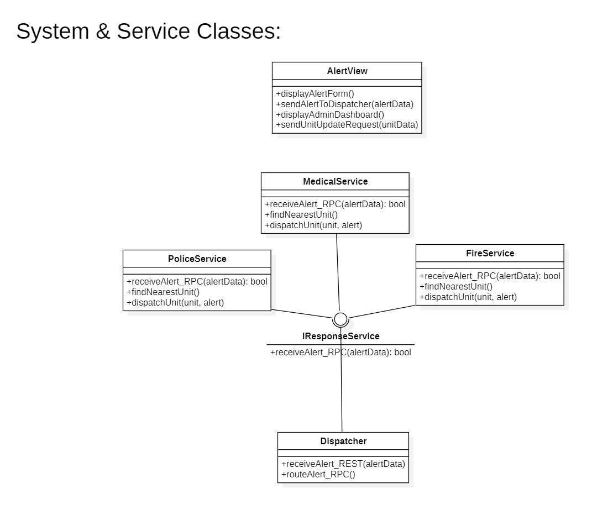
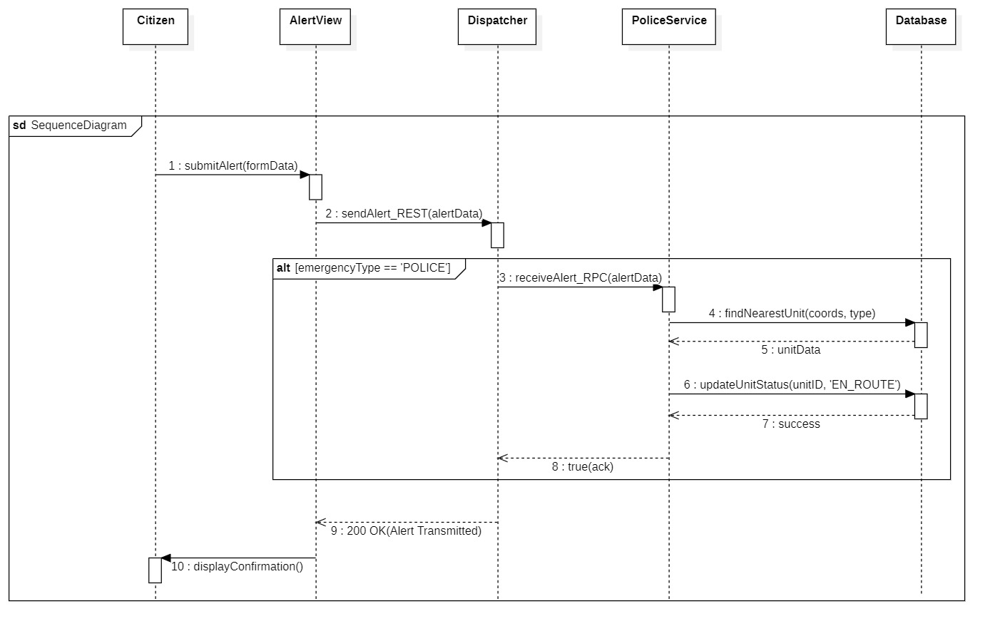
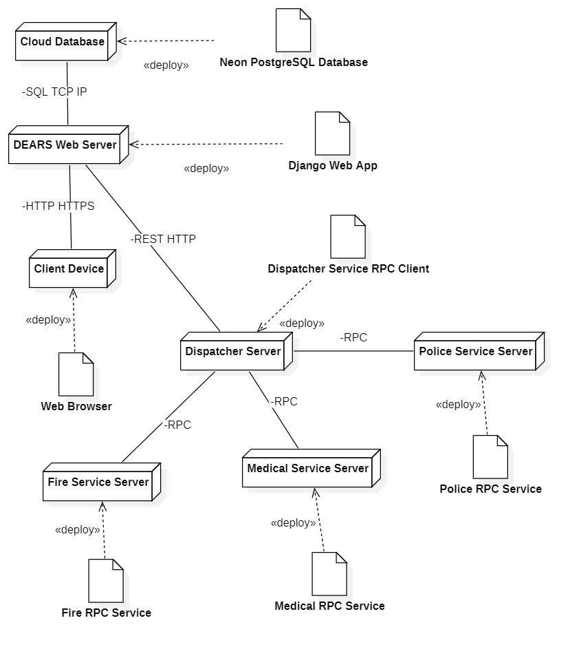

## Distributed Emergency Alert & Response System (DEARS)

**Initial Design, Objectives, and Architecture (MVP)**

- **Author:** Anass Allabouch
- **Date:** 07/11/2025

---

## 1. Introduction and Project Objective

### 1.1 Project Objective

The goal of this project is to implement a **Distributed Emergency Alert & Response System (DEARS)**. This system will allow citizens to rapidly report emergency situations (such as Police, Fire, or Medical) via a user-friendly web interface.

The core of the system lies in its distributed architecture, which will **intelligently route** these alerts to the appropriate response services (Police, Firefighters, Medical Services) using remote communication technologies.

### 1.2 Distributed Context

In accordance with project requirements, a distributed architecture is not only required but essential for the nature of this application. The desired advantages are:

- **Resilience:** The separation of services (e.g., Police Service, Fire Service) ensures that the failure of one component does not lead to a complete system shutdown.
- **Scalability:** Each service (Web Interface, Dispatcher, Response Services) can be scaled independently to handle different loads.
- **Specialization:** Allows each emergency service to manage its own business logic and resources autonomously after receiving an alert.

---

## 2. Key Features (MVP) and Roles

### 2.1 System Actors

| Actor                          | Primary Role                                                                                             |
| :----------------------------- | :------------------------------------------------------------------------------------------------------- |
| **Citizen**                    | Any user accessing the web interface to submit an emergency alert.                                       |
| **Dispatcher (System)**        | The automated central component that receives and routes alerts.                                         |
| **Response Services (System)** | The backend components (Police, Fire, Medical) that receive the routed alerts.                           |
| **Administrator**              | User with high privileges for system supervision and response unit management (Not prioritized for MVP). |

### 2.2 Minimum Viable Product (MVP) Features

| Role                            | Features                                                                                                                                                                                                                                                                                    |
| :------------------------------ | :------------------------------------------------------------------------------------------------------------------------------------------------------------------------------------------------------------------------------------------------------------------------------------------ |
| **Alert Management (Citizen)**  | _ Submit a new emergency alert via a web form. _ Select the type of emergency (Police, Fire, Medical). _ Provide a brief description. _ Provide location coordinates (e.g., simulation by input or map click). \* Receive confirmation of alert submission.                                 |
| **Alert Routing (Dispatcher)**  | _ Receive the alert from the web interface (via REST/HTTP). _ Validate and analyze the alert (type, location). \* Transmit the alert to the appropriate distributed service via a **Remote Procedure Call (RPC)**.                                                                          |
| **Alert Processing (Services)** | _ Receive the remote call (RPC) from the Dispatcher. _ Log the alert in the shared database. _ Execute business logic: identify the closest and available response unit (based on coordinates). _ Update the unit status (e.g., "en route"). \* Return an acknowledgment to the Dispatcher. |

---

## 3. Technology Choices and Architecture

### 3.1 Distributed Communication Technology

**Choice: RPC (Remote Procedure Call)**

**Justification:** The project mandates the use of RPC, RMI, or CORBA. Since the team has chosen Python as the main language, RPC is the natural technology choice, as specified in the project document (Python (for RPC)). This allows for maintaining a consistent technology stack (Full-Stack Python).

### 3.2 Technology Stack

| Component                           | Technology  | Library / Framework                                       |
| :---------------------------------- | :---------- | :-------------------------------------------------------- |
| **Distributed Backend Services**    | Python      | `xmlrpc.server` (Python standard library for RPC) or gRPC |
| **Backend (Dispatcher)**            | Python      | `xmlrpc.client` (Python standard library for RPC)         |
| **Web Interface (Frontend)**        | Python      | Django                                                    |
| **Web -> Dispatcher Communication** | REST (HTTP) | REST API provided by Django                               |
| **Database**                        | PostgreSQL  | Neon (https://neon.com/) - Serverless Postgres            |
| **Version Control**                 | Git         | GitHub                                                    |

### 3.3 Detailed Architecture and Data Flow

The alert processing flow is as follows:

1.  **Submission (Web UI):** The Citizen fills out the form on the **Django Web App**. The application sends a **REST (HTTP) request** to the **Dispatcher Server**.
2.  **Routing (Dispatcher):** The Dispatcher Server (a Python server) receives the HTTP request. It analyzes the emergency type and coordinates.
3.  **Distributed Call (RPC):** The Dispatcher acts as an RPC Client. It performs a Remote Procedure Call (e.g., `send_police_alert(coords, description)`) to the RPC Server of the relevant service (Police Service, Fire Dept Service, or Medical Service).
4.  **Processing (Distributed Services):** The Services (Police, Fire, Medical) are independent Python RPC Servers.
    - They receive the RPC call.
    - They connect to the **Shared Database (PostgreSQL)** to query available units.
    - They select the closest unit and update its status in the database.
    - They return a success confirmation to the Dispatcher Server via the RPC response.
5.  **Confirmation (Web UI):** The Dispatcher Server receives the RPC confirmation and sends an HTTP response (e.g., "Alert received and transmitted") back to the Django Web App, which informs the citizen.

## 4. Team Role Distribution (8 Members)

| Role                                   | Count | Primary Responsibilities                                                                                                                                                     |
| :------------------------------------- | :---- | :--------------------------------------------------------------------------------------------------------------------------------------------------------------------------- |
| **Project Manager & System Architect** | 1     | Designs the distributed architecture, plans tasks, coordinates the team, manages GitHub, validates deliverables, and supervises tests.                                       |
| **Backend Developers**                 | 4     | Implement remote servers (RPC), define remote interfaces and methods, ensure client-server communication, and database integration. (Includes Dispatcher and the 3 Services) |
| **Frontend Web Developers**            | 2     | Develop the user interface (HTML, CSS, JavaScript, Django), ensure interaction with the backend (REST), and optimize user experience.                                        |
| **Database Engineer**                  | 1     | Designs and manages the database schema (PostgreSQL), configures the connection, and optimizes SQL queries.                                                                  |

## 5. UML Diagrams

### 5.1 Use Case Diagram


The Use Case diagram above illustrates the core interactions in the DEARS system:

**Actors:**

- **Citizen**: Can submit emergency alerts
- **Administrator**: Manages response units and monitors alerts

**Main Use Cases:**

- **Submit Emergency Alert**: Allows citizens to report emergencies
- **Manage Response Units**: Enables administrators to handle unit operations
- **Edit/Add/Remove Response Unit**: Sub-functions of unit management
- **View Alert Dashboard**: Provides administrators with system overview

**Relationships:**

- The «include» relationships show that unit management includes the ability to edit, add, and remove response units

### 5.2 Class Diagram




The Class Diagram is split into two complementary parts to match the structure used in the Use Case section: Core Data Entities (the domain model persisted to PostgreSQL) and System & Service Classes (runtime components and distributed interfaces).

Core Data Entities

- Purpose: represent the primary domain objects that map to database tables.
- User
  - Roles: CITIZEN, ADMIN (UserRole enum).
  - Responsibilities: submit alerts, view alert history; ADMIN can manage ResponseUnits.
- Alert
  - Fields include id, timestamp, description, latitude/longitude, EmergencyType, and AlertStatus.
  - Behaviours: updateStatus(newStatus), assignUnit(unitID).
- ResponseUnit
  - Represents an emergency unit (unitID, unitName, unitType, currentLocation, UnitStatus).
  - Behaviours: updateStatus(newStatus), updateLocation(location).
- Enumerations
  - AlertStatus, EmergencyType, UnitStatus, UserRole: enforce valid values and simplify DB constraints.

System & Service Classes

- Purpose: model controllers, the dispatcher, and distributed RPC services (the verbs).
- AlertView (Django frontend)
  - Presents alert form, validates input, and calls the Dispatcher REST endpoint.
- Dispatcher
  - REST endpoint receiver and router. Persists initial Alert record and routes to the correct response service via RPC.
- IResponseService (RPC interface)
  - Contract implemented by all response services. Key method: receiveAlert_RPC(alertData) → acknowledgment.
- PoliceService, FireService, MedicalService
  - Implement IResponseService. Business logic: find nearest AVAILABLE ResponseUnit, update unit and alert state in DB, return ack.

Relationships (concise)

- User 1..\* -> Alert (submit): Citizens create alerts; alerts persist in DB.
- Admin (UserRole=ADMIN) manages 0..\* ResponseUnit.
- Alert 0..1 -> ResponseUnit (assign): an Alert may be assigned one ResponseUnit.
- Enums constrain status/type fields to preserve integrity and guide service logic.

Interaction / Flow (mirrors Use Case style)

1. Citizen submits alert via AlertView (HTTP POST).
2. AlertView → Dispatcher (REST): Dispatcher validates and persists the Alert.
3. Dispatcher → appropriate ResponseService (RPC using IResponseService.receiveAlert_RPC).
4. ResponseService queries DB, selects nearest AVAILABLE unit, updates unit status (e.g., EN_ROUTE), writes changes to DB and returns acknowledgement.
5. Dispatcher relays confirmation back to AlertView; UI notifies the citizen.

Design notes

- Separation of concerns: UI = presentation, Dispatcher = coordination/routing, Services = domain-specific dispatching.
- RPC contract (IResponseService) makes services replaceable and independently deployable.
- Domain model maps cleanly to PostgreSQL; enums and controlled transitions reduce inconsistent state.

### 5.3 Sequence Diagram



This sequence diagram presents the step-by-step flow for the "Submit Emergency Alert" use case, shown here for a Police alert. It follows the same Use Case style: actor → system components → data store, with an explicit routing decision in the Dispatcher.

Interaction / Step-by-step Flow

1. Citizen submits the alert form on AlertView (Django frontend).
2. AlertView sends a REST (HTTP) request to the Dispatcher.
3. Dispatcher evaluates the alert type using a Combined Fragment (alt).
   - Guard: [emergencyType == 'POLICE']
4. Under the Police guard, Dispatcher issues an RPC call to the PoliceService (receiveAlert_RPC).
5. PoliceService queries the Database to findNearestUnit(coordinates).
6. Database returns unitData (nearest available unit).
7. PoliceService updates the unit status in the Database to EN_ROUTE (updateUnitStatus).
8. Database returns success ack; PoliceService returns RPC acknowledgement to Dispatcher.
9. Dispatcher responds 200 OK to AlertView, completing the REST interaction.
10. AlertView displays confirmation to the Citizen (displayConfirmation()).

Notes

- The Combined Fragment (alt) models routing logic for different emergency types (POLICE / FIRE / MEDICAL).
- DB interactions are authoritative: services read/write unit and alert state in the shared PostgreSQL store.
- The diagram focuses on interaction order and responsibilities rather than implementation details (e.g., specific RPC library or HTTP status payloads).

### 5.4 Deployment Diagram



The Deployment Diagram illustrates the physical and virtual topology of DEARS: where components run, what artifacts they deploy, and how they communicate.

Nodes (Servers)

- Client Device
  - Web browser on a PC or mobile device used by Citizens and Administrators.
- DEARS Web Server
  - Hosts the Django Web App (AlertView, admin dashboard). Receives HTTP/HTTPS requests from clients.
- Dispatcher Server
  - Runs the Dispatcher REST service that validates alerts and routes them to response services.
- Police / Fire / Medical Service Servers
  - Three independent nodes, each running a specific RPC service implementing IResponseService. Separation improves resilience and allows independent scaling.
- Cloud Database
  - Managed Neon (PostgreSQL) instance shared by all backend services (authoritative persistent store).

Artifacts (Software deployed to nodes)

- Django Web App artifact → deployed to DEARS Web Server.
- Dispatcher Service artifact (REST API) → deployed to Dispatcher Server.
- RPC Service artifacts (PoliceService, FireService, MedicalService) → deployed to respective service servers.
- Database schema and migrations → deployed/managed on Cloud Database.

Communication Paths (Protocols)

- Client → Web Server: HTTP/HTTPS (user interactions, form submission).
- Web Server → Dispatcher: REST over HTTP (alert submission endpoint).
- Dispatcher → Response Services: RPC (receiveAlert_RPC) for routing alerts.
- All backend nodes ↔ Cloud Database: TCP/IP (PostgreSQL protocol / SQL) for reads/writes.

Interaction / Flow (mirrors Use Case style)

1. Citizen submits alert via browser → HTTP POST to Django Web Server.
2. Web Server validates input and issues REST POST → Dispatcher Server.
3. Dispatcher persists initial Alert and invokes RPC → appropriate Response Service.
4. Response Service queries DB, selects and updates ResponseUnit, persists changes, returns RPC ack.
5. Dispatcher relays outcome to Web Server → Web Server notifies the user.

Deployment Considerations (concise)

- Resilience: Service-node separation limits blast radius; failed service does not stop others.
- Scalability: Stateless web and dispatcher layers can be load-balanced; RPC services scale independently.
- Security: Enforce TLS for HTTP/RPC, authenticate dispatcher→service RPCs, and restrict DB access using managed credentials and network policies.
- Observability: Centralized logs and health checks per node; use metrics & alerts for service-level issues.

## 6. Implementation Plan & Next Steps

Team,

The architectural design phase is complete. Our UML diagrams (Section 5) serve as the definitive blueprints for implementation. We will now move into parallel development tracks based on the roles defined in Section 4.

The immediate priority for **all teams** is to establish the core project scaffolding and database.

### Phase 1: Foundation (Priority 1)

**1. Set Up Repository Structure (PM & Leads):**

- The project repository will be structured to mirror our **Deployment Diagram (5.4)**.
- Create top-level directories: `/django_web_app`, `/dispatcher_service`, `/response_services` (with sub-folders `/police_service`, `/fire_service`, `/medical_service`), and a `/shared` directory.

**2. Implement Database Schema (Database Engineer & Backend Team):**

- This is the most critical first step.
- **Source of Truth:** The **Core Data Entities Class Diagram (5.2)**.
- **Action:** In the `django_web_app` project, create the `models.py` file.
- **Models Required:** `User` (using Django's built-in User or a custom one), `Alert`, and `ResponseUnit`.
- **Enums:** All enumerations (`AlertStatus`, `EmergencyType`, etc.) must be implemented as model `Choices` fields to ensure data integrity.
- **Goal:** Run `makemigrations` and `migrate` to successfully build the tables in our **Neon (PostgreSQL)** database.

**3. Define the RPC Contract (Backend Team):**

- Create a file in the `/shared` directory (e.g., `rpc_interface.py`).
- **Source of Truth:** The **System & Service Classes Diagram (5.2)** and **Sequence Diagram (5.3)**.
- **Action:** Define the abstract "contract." At a minimum, this will be the function signature `receiveAlert_RPC(alertData)`. This "contract" will be imported by both the Dispatcher (client) and the Response Services (servers).

### Phase 2: Parallel Development Tracks (By Role)

Once Phase 1 is complete, teams will work in parallel.

**For the Database Engineer (1):**

- Lead the Phase 1 database implementation.
- Configure and document the **Neon (PostgreSQL)** connection settings in the Django `settings.py` and for all backend services.
- Begin R&D on the `findNearestUnit` SQL query. This is a high-priority, complex query that will likely require geospatial functions (e.g., PostGIS or equivalent calculations) to compare `Alert` and `ResponseUnit` coordinates.

**For the Frontend Web Developers (2):**

- **Focus:** The `django_web_app` component.
- **Source of Truth:** **Use Case (5.1)** and **Sequence Diagram (5.3)**.
- **Actions:**
  1.  Implement basic User Authentication (Citizen registration, Admin login).
  2.  Build the `AlertView` (Django view and template) for the "Submit Emergency Alert" form (Feature 2.2).
  3.  Implement the client-side REST call (`sendAlert_REST`) that sends the `formData` to the Dispatcher's endpoint (Sequence Diagram step 2).
  4.  Build the initial "Manage Response Units" and "View Alert Dashboard" pages for the Administrator role (stubs for now).

**For the Backend Developers (4):**

- **Focus:** `dispatcher_service` and `response_services` components.
- **Source of Truth:** **Class Diagram (5.2)**, **Sequence Diagram (5.3)**, **Deployment Diagram (5.4)**.
- **Actions:**
  1.  **Dispatcher Service:**
      - Implement the REST API endpoint that _receives_ the `sendAlert_REST` call from the `django_web_app`.
      - Implement the RPC _client_ logic. This client will read the `emergencyType` and make the correct `receiveAlert_RPC` call to the appropriate service (Police, Fire, or Medical).
  2.  **Response Services (Police, Fire, Medical):**
      - Implement the three RPC _servers_ (one for each service).
      - Each server must implement the `IResponseService` "contract" (from Phase 1).
      - Implement the core business logic: `findNearestUnit` (using the DB Engineer's query) and `updateUnitStatus` (Sequence Diagram steps 4-7). This involves **critical database read/write operations**.

### 6.1 Deliverables & Short Milestones

- Scaffold projects and push initial branch structure within 48 hours.
- Database models and migrations completed and verified on Neon within 5 working days.
- Shared RPC interface and simple integration test (Dispatcher ↔ dummy ResponseService) within 7 working days.
- Basic Alert submission flow end-to-end (UI → Dispatcher → mock RPC → DB ack → UI) within 10 working days.

---

## 7. Version Control & GitHub Protocol

Team,

To maintain a clean and functional codebase, we will follow a strict Git workflow. This is mandatory. **Under no circumstances should anyone push code directly to the `main` branch.** I will be solely responsible for reviewing and merging all code.

### 7.1 Your Workflow (Mandatory)

1.  **Always Pull First:** Before starting _any_ new work, get the latest code to avoid conflicts:

    ```bash
    git checkout main
    git pull origin main
    ```

2.  **Create a New Feature Branch:** All work _must_ be done on a new branch. Name it clearly based on your assigned task.

    - **Naming Convention:** `feature/<task-name>` (e.g., `feature/alert-form-view`) or `fix/<bug-name>` (e.g., `fix/user-login-bug`).
    - **Command:** `git checkout -b feature/your-task-name`

3.  **Work and Commit:** Do your work on this branch. Commit small, logical changes with clear messages (e.g., "feat: Add Alert model to models.py").

4.  **Keep Your Branch Updated:** To prevent merge conflicts, frequently pull the latest changes from `main` _into_ your feature branch:

    ```bash
    git pull origin main
    ```

    (This will merge the latest `main` into your branch. Fix any conflicts that arise on your local branch).

### 7.2 Code Review & Merging

1.  **Push Your Branch:** When your feature is complete and tested, push your branch to GitHub:

    ```bash
    git push origin feature/your-task-name
    ```

2.  **Open a Pull Request (PR):**

    - Go to the GitHub repository.
    - Open a new **Pull Request (PR)**, comparing your `feature/your-task-name` branch to the `main` branch.
    - **Title:** Give it a clear title (e.g., "Feature: Implement Alert Submission Form").
    - **Description:** Briefly describe _what_ you did and _why_.
    - **Assign Reviewer:** Assign **AllabouchAnas** as the reviewer.

3.  **Merge (My Responsibility):**

    - **Do not merge your own PR.**
    - I will review the code, request changes if necessary, and then **I will perform the merge into `main`**.
    - Once merged, you can safely delete your feature branch and `git pull origin main` to start your next task.

> **Project Manager's Note:** This process protects our `main` branch from broken code and ensures all changes are reviewed. Pulling from `main` frequently (Step 4) is the best way to prevent large, difficult merge conflicts.
